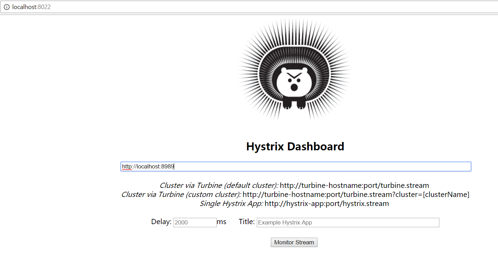

# 05-practice-hystrix-turbine-kafka-dashboard
workable version of spring cloud hystrix turbine stream dashboard kafka

# Step1: start hystrix dashboard server
- this is only run by itself. Just a UI display page to see the result. 
# Step2: start turbine server
- this is used to collect all the metrics from kafka. Kafka binder should be used or rabbmit binder
# Step3: enable microservice hystrix collector
- add spring-cloud-netflix-hystrix-stream, spring-cloud-starter-stream-*, see hello1 and hello2
- this will automatically send the informations into turbine server which is collected by kafka.
# Step3-NOTICE: enable eurekaClient is very importand for hystrix-stream. it must use this client. But you don't need to have a eureka server at the same time. So don't worry about the exception of register eureka server.

# Test1:
- Object: To see if single hystrix is working.
- 1. open http://localhost:8022 you can see hystrix dashboard there
- 2. put http://localhost:9090/hystrix.stream into the input field and click monitor

- 3. click again and again http://localhost:9090/hello1
- 4. see result from dashboard. you can see the single result of a micro service.

# Test2: 
- Object: to see if aggregate is working for turbine
- 1. open http://localhost:8022 you can see hystrix dashboard there
- 2. put http://localhost:8989 into the input field and click monitor

- 3. click again and again http://localhost:9090/hello1 and http://localhost:9091/hello2
- 4. see result from dashboard. you can see the aggregate result of a micro service.

